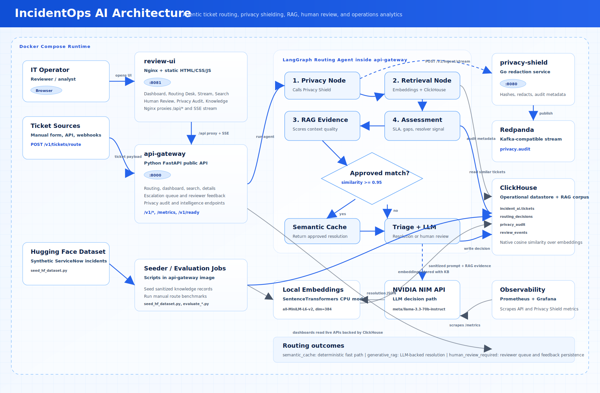

# IncidentOps AI Architecture Diagram

The diagram below reflects the current Docker Compose runtime, frontend/API boundary, LangGraph routing workflow, privacy service, event stream, persistence layer, external LLM dependency, and observability stack.

## Accuracy Notes

- `review-ui` is an Nginx-served static frontend on port `8081`; it proxies `/api/*` and the ticket SSE stream to `api-gateway`.
- `api-gateway` is the FastAPI service on port `8000`; it owns API endpoints, dashboard/search/detail data, routing, review feedback, and metrics.
- The routing workflow runs inside `api-gateway` with LangGraph nodes: privacy, retrieval, RAG evidence, assessment, semantic-cache fast path, triage, LLM decisioning, and escalation.
- `privacy-shield` is a Go service on port `8080`; it redacts sensitive data, emits audit metadata, and publishes audit events to Redpanda.
- ClickHouse stores `tickets`, `routing_decisions`, `privacy_audit`, and `review_events`, and is also used for vector-style retrieval over stored embeddings.
- NVIDIA NIM is the external LLM decision path for non-cache RAG routing.
- Prometheus scrapes `/metrics` from `api-gateway` and `privacy-shield`; Grafana is the dashboard shell.

